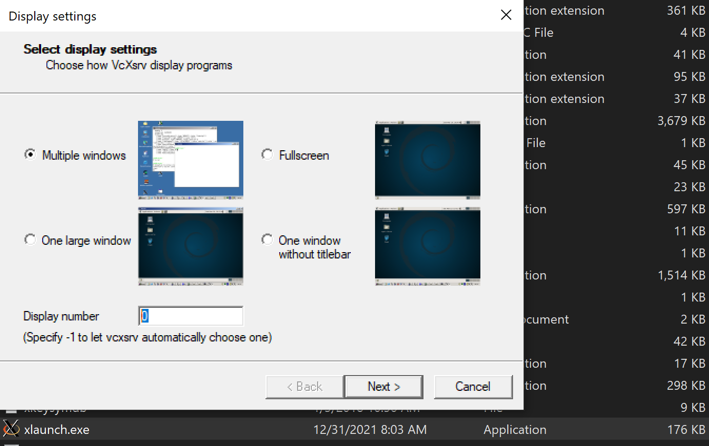

# ROS Noetic with Docker Containers

This example will guide you through creating two simple ROS nodes in Python: one node to publish the string "Hello, World" and another node to subscribe to this message and print it out. We will use ROS Noetic and have it installed on Ubuntu 20.04, this general approach is similar for other ROS versions.

**NOTE**: Step 3 to 7 can be done natively if needed. The only difference is that 3 terminals will be required and no need to connect to any container.

## 1. Setup ROS environment

### Step 1. (Optional) Create a custom image

This will create 3 Docker images: 1) Firs image is based on Ubuntu 20.04 with all the **required dependencies to install and build ROS1 Noetic** and **creates a user with sudo privileges**. 2) Second image will install ROS Noetic from the steps of the official page [documentation](http://wiki.ros.org/noetic/Installation/Ubuntu). Lastly the 3) third image **configures the container** `entrypoint` and `source` the ROS global configuration (i.e. `/opt/ros/noetic/setup.bash`).

A general note, the order on how this images are created is important since they interdependent.

```bash
# This approach allow is to debug more easily if there is a bug on the build
docker build -t ros-deps   . -f ROS-deps.Dockerfile
docker build -t ros-noetic . -f ROS-noetic.Dockerfile
docker build -t ros-dev    . -f ROS-dev.Dockerfile
```

### Step 2.  Run a ROS Container 

Create a user container from the custom image:

```bash
docker run --rm --name ros-master -it -v ${PWD}/catkin_ws/src:/home/ros/catkin_ws/src ros-dev
```

Create a root container with ROS installed from the official Docker image.

```bash
docker run --rm --name ros-master -it -v ${PWD}/catkin_ws/src:/home/ros/catkin_ws/src -w /root ros:noetic
```

---

## 2. Create ROS package


### Step 3: Create a ROS Package

First, you need to create a ROS package. Open a terminal natively or in your container and navigate to your catkin workspace's `src` directory (create a new workspace if you don't have one):

```bash
cd ~/catkin_ws/src
```

Create a new package named `hello_world_pkg` with dependencies on `rospy` and `std_msgs`:

```bash
catkin_create_pkg hello_world_pkg rospy std_msgs
```

**Troubleshooting**:

Make sure ROS is installed an available

```
printenv | grep ROS
```

If no environment variables are set then try again running this first:

```
source /opt/ros/noetic/setup.bash
```

Also check if this is not set in `.bashrc` already:

```
cat ~/.bashrc | grep source /opt/ros/noetic/setup.bash
```


### Step 4: Write the Publisher Node

Navigate into your new package and create a script for the publisher:

```bash
cd hello_world_pkg
mkdir scripts
cd scripts
```

Create a file named `talker.py`:

```bash
touch talker.py
```

Edit `talker.py` using a text editor and add the following content:

```python
#!/usr/bin/env python3
import rospy
from std_msgs.msg import String

def talker():
    pub = rospy.Publisher('chatter', String, queue_size=10)
    rospy.init_node('talker', anonymous=True)
    rate = rospy.Rate(10) # 10hz
    while not rospy.is_shutdown():
        hello_str = "Hello, world %s" % rospy.get_time()
        rospy.loginfo(hello_str)
        pub.publish(hello_str)
        rate.sleep()

if __name__ == '__main__':
    try:
        talker()
    except rospy.ROSInterruptException:
        pass
```

Make the script executable:

```bash
chmod +x talker.py
```

### Step 5: Write the Subscriber Node

In the same `scripts` directory, create a file named `listener.py`:

```bash
touch listener.py
```

Edit `listener.py` and add the following content:

```python
#!/usr/bin/env python3
import rospy
from std_msgs.msg import String

def callback(data):
    rospy.loginfo(rospy.get_caller_id() + "I heard %s", data.data)

def listener():
    rospy.init_node('listener', anonymous=True)
    rospy.Subscriber("chatter", String, callback)
    rospy.spin()

if __name__ == '__main__':
    listener()
```

Make the script executable:

```bash
chmod +x listener.py
```

### Step 6: Build the Package and Source the Workspace

Navigate back to the **root of your catkin workspace** and build the package:

```bash
cd ~/catkin_ws
catkin_make
```

Source the workspace to make sure the newly created package is found:

```bash
source devel/setup.bash
rospack list | grep hello 
```

Expected output:

```bash
hello_world_pkg /home/ros/catkin_ws/src/hello_world_pkg
```

**NOTE**: You can leave this container open for the next steps or you can close it for now.

---

## 3. Running ROS package

### Step 7: Run the Publisher and Subscriber

**Running natively:**

Start a ROS Master in a terminal instance:

```bash
roscore
```

From your `catking_ws`, open two new terminal windows or tabs. In the first one, run the publisher node:

```bash
source devel/setup.bash
rosrun hello_world_pkg listener.py
```

In the second one, run the subscriber node:

```bash
source devel/setup.bash
rosrun hello_world_pkg talker.py
```

You should see the subscriber node printing the "Hello, world" messages with timestamps that the publisher node sends.


**Running from a single container:**

Now, you can run your ROS nodes inside the container. Open two new separate terminal windows or tabs for the publisher and subscriber nodes. You will need to attach to the running container from another terminal.

In the running container you need to run `roscore` or you can create a new one if is not already running:

```bash
docker run --rm --name ros-master -it ros-dev roscore
```

For the listener, in one of the tabs connect to the `ros-master` container using the container name or `CONTAINER_ID`:

```bash
docker exec -it ros-master bash # or <CONTAINER_ID> instead of the name
source devel/setup.bash
rosrun hello_world_pkg listener.py
```

To run the talker, do the same: 

```bash
docker exec -it ros-master bash  # or <CONTAINER_ID> instead of the name
source devel/setup.bash
rosrun hello_world_pkg talker.py
```

**Troubleshooting**

If is not in `~/.bashrc` or `source ~/.bashrc` does not work, do this and try again:

```bash
source /opt/ros/noetic/setup.bash
```

### Step 8: (Optional) Create a network and communicate through separate containers

> :warning: **This needs to be run from the root directory of this project**

With the custom image, first create a network 

```bash
docker network create ros-network
```

:warning: The next steps need to be run from the project root directory:

This approach needs to mount the previous folder structure mounted (Step 3 to 5)
Otherwise all the steps need to be repeated on every container

Then create a master container:

```bash
docker run --rm --name ros-master --network ros-network -it ros-dev roscore
```

Create a listener container: 

```bash
docker run --rm --name ros-listener --network ros-network -it -v ${PWD}/catkin_ws/src:/home/ros/catkin_ws/src -e ROS_MASTER_URI=http://ros-master:11311 ros-dev "catkin_make && source devel/setup.bash && rosrun hello_world_pkg listener.py"
```

Create a talker container:

```bash
docker run --rm --name ros-talker --network ros-network -it -v ${PWD}/catkin_ws/src:/home/ros/catkin_ws/src -e ROS_MASTER_URI=http://ros-master:11311 ros-dev "catkin_make && source devel/setup.bash && rosrun hello_world_pkg talker.py"
```

 ### Step 9: (Optional) Using docker compose:

Run 
```bash
docker compose up
```

Stop
```bash
docker compose down
```

### Step 10: (Optional) Using ROS graphical apps:


[Download](https://sourceforge.net/projects/vcxsrv/) XServer for Windows and install it.

Once installed open `xlaunch.exe` and change the display number `0` as shown in the image below.



Now to save some time, download an image with docker desktop installed. Otherwise, we would need to install the desktop features in the base image `ros:noetic` or our custom image which takes long time.


First start a container with the following arguments to support graphic applications

> :warning: This will show an error because roscore it's not running yet.

```bash
docker run --rm --name ros-gui -e DISPLAY=host.docker.internal:0.0 -it osrf/ros:noetic-desktop
rosrun turtlesim turtlesim_node
```

Then start `roscore` from the same container

```bash
docker exec -it ros-gui bash

# inside the container
source opt/ros/noetic/setup.bash
roscore
```


### Additional notes

The previous images help to run `ROS Noetic` commands without any additional configuration. :warning: This uses the `ros-noetic` image, therefore skipping the `ros-dev` image, also this wont work with the latter.

These are the manual steps to achieve the same results if there was no entrypoint:

Manual steps:

1. Start ROS Master
    ```bash
    docker run --rm \
            --name ros-master \
            --network ros-network \
            -it \
            ros-noetic \
            bash -c "source /opt/ros/noetic/setup.bash && roscore"
    ```

2. Start ROS Listener:
    ```bash
    docker run --rm \
            --name ros-listener \
            --network ros-network \
            -it \
            -v ${PWD}/catkin_ws/src:/home/ros/catkin_ws/src \
            -e ROS_MASTER_URI=http://ros-master:11311 \
            ros-noetic \
            bash -c "source /opt/ros/noetic/setup.bash && \
                        catkin_make && \
                        source devel/setup.bash && \
                        rosrun hello_world_pkg listener.py"
    ```


3. Start ROS Talker:
    ```bash
    docker run --rm \
            --name ros-talker \
            --network ros-network \
            -it \
            -v ${PWD}/catkin_ws/src:/home/ros/catkin_ws/src \
            -e ROS_MASTER_URI=http://ros-master:11311 \
            ros-noetic \
            bash -c "source /opt/ros/noetic/setup.bash && \
                        catkin_make && \
                        source devel/setup.bash && \
                        rosrun hello_world_pkg talker.py"
    ```


