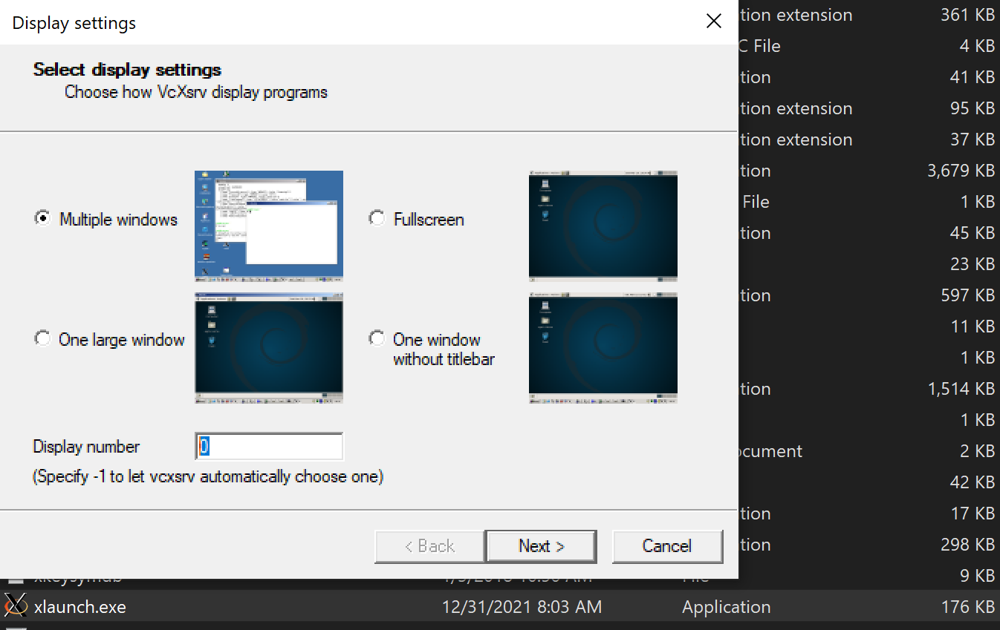

[Back to Contents](../README.md)

## GUI Examples

You need to have XServer installed, Ubuntu Desktop includes XServer already.

### Windows

For Winwdows you need to install an alternative, for example: [Download VcXsrv](https://sourceforge.net/projects/vcxsrv/).

Once installed open `xlaunch.exe` and change the display number `0` as shown in the image below.



Add the following argument to support graphic applications.

```bash
-e DISPLAY=host.docker.internal:0.0
```

To run in the terminal: 

```bash
docker run -it --rm --name ros-noetic -e DISPLAY=host.docker.internal:0.0 ros-noetic-workspace
```

### Launching Turtlesim

To start the `turtlesim` node, open a new terminal within the DevContainer or Docker container and execute:

> :warning: `roscore` must be running already.

```bash
rosrun turtlesim turtlesim_node
```

This command launches a window displaying a turtle in an aquatic environment, waiting for your commands to move around.

### Controlling Turtlesim

To control the turtle, open another terminal and run:


```bash
# Connect to running container
docker exec -it ros1-noetic bash

# Inside the container
rosrun turtlesim turtle_teleop_key
```

This command allows you to use keyboard inputs to control the movement of the turtle in the `turtlesim` window.

> :warning: Ensure that the terminal window running turtle_teleop_key is in focus when pressing the keyboard arrows. If the terminal is not focused, it won't capture the keypress events.

### Exploring ROS Noetic with Command Line Tools

ROS Noetic continues to offer a comprehensive set of command-line tools that enable you to discover and interact with nodes, topics, services, and more within your ROS 1 environment.

### Listing ROS Topics

To see the list of active topics in ROS Noetic, use:

```bash
rostopic list
```

### Echoing Data from a Topic

To view the data being published on a topic in ROS Noetic, replace `<topic_name>` with the actual topic you are interested in:

```bash
rostopic echo <topic_name>
```

For instance, to echo the pose of the turtle in `turtlesim`, you might use:

```bash
rostopic echo /turtle1/pose
```

### Listing ROS Packages

To list the ROS packages in your workspace for ROS Noetic, you can utilize:

```bash
rospack list
```

### Checking ROS Node Info

To obtain more detailed information about a specific node in ROS Noetic, such as the services and topics it interacts with, use:

```bash
rosnode info <node_name>
```

### Running ROS Services

Here's how you might call a service to clear the `turtlesim` screen, though the exact service name and type could vary based on the specific setup and version:

```bash
rosservice call /clear
```

This command intends to clear the drawing in the `turtlesim` window, though `turtlesim` might use a slightly different service or message type. 

## Conclusion

Whether using the DevContainer for a seamless development experience in VSCode or running Docker directly, this setup facilitates ROS development, ensuring a consistent and isolated environment for building and testing ROS packages.

---

[Previous: Use the devcontainer for Debugging](./06_Devcontainer.md) | [Next: Additional notes](./08_Additional_Notes.md)
